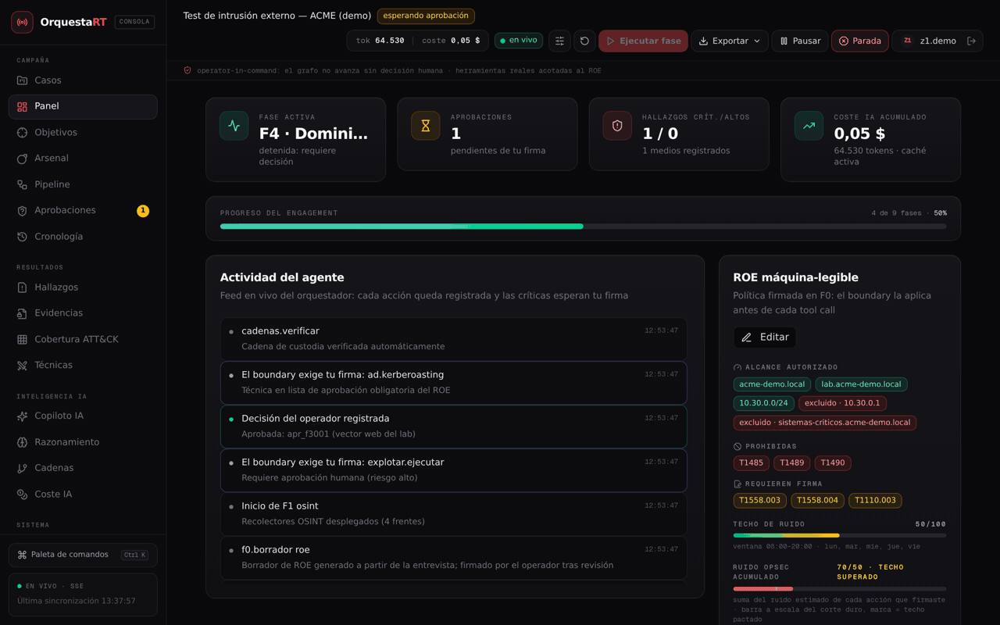
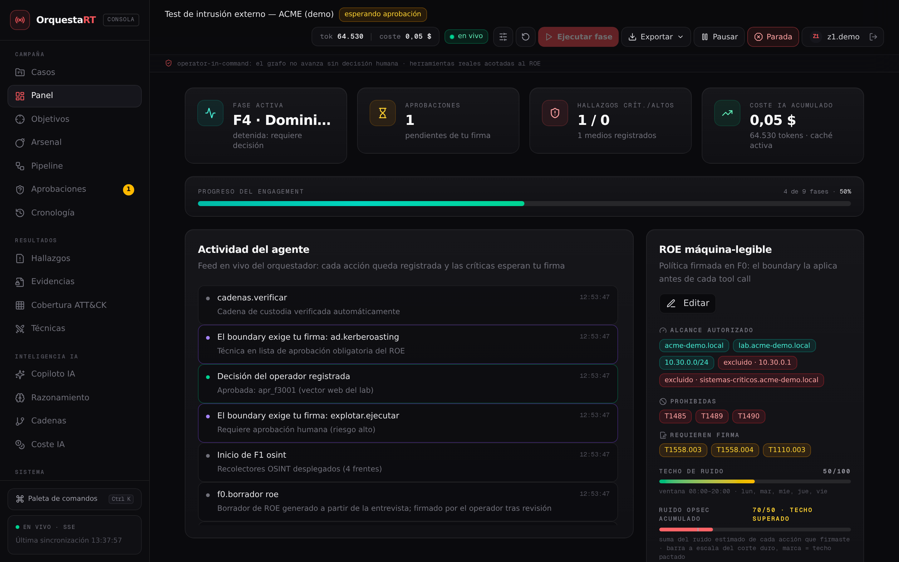
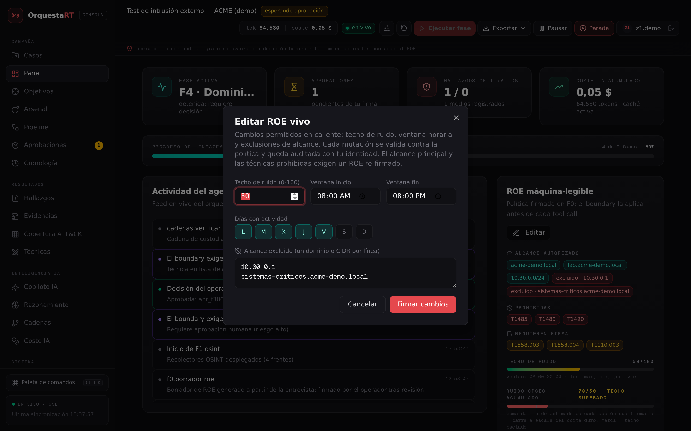
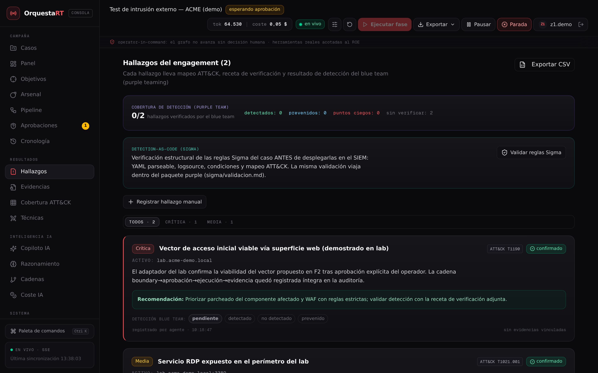
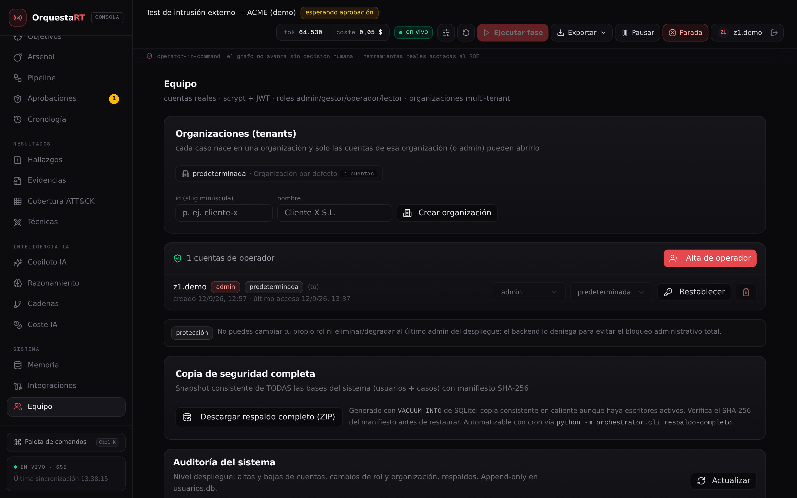

# OrquestaRT — Plataforma de Red Team Orquestado por IA


> Arquitectura agéntica completa para operaciones ofensivas **autorizadas**:
> orquestación multiagente (F0→F7), boundary ROE *operator-in-command*, cadena
> de custodia de evidencias, cadenas threat-led estilo Atomic Red Team,
> rutas de ataque reales con Neo4j/BloodHound, SSO federado y multi-tenant.
> Interfaz, informes y auditoría en español. Despliegue on-prem, Docker/K8s.



*Recorrido real: panel del caso en vivo (KPIs, feed SSE, ROE) → edición del
ROE vivo (v28) → aprobaciones del boundary → hallazgos con validación Sigma →
matriz de cobertura ATT&CK entre campañas → cadenas threat-led → copiloto
IA → gestión del equipo con auditoría del sistema (v28) → higiene de la
cuenta. Todo operando contra el orquestador y el laboratorio reales — sin
maquetas.*

| | |
|---|---|
|  |  |
| *Panel del caso en vivo (SSE): KPIs, actividad del agente, ROE con techo de ruido y custodia.* | *ROE vivo editable (v28): techo de ruido, ventana horaria y exclusiones, auditado con identidad.* |
|  |  |
| *Hallazgos con detección VECTR y validación detection-as-code (Sigma) antes de entregar al SIEM.* | *Equipo multi-tenant (v28): reasignación de organización, auditoría del despliegue y respaldo completo.* |

---

## ⚠️ Aviso legal y de uso

Este software es **herramienta profesional para pruebas de intrusión
AUTORIZADAS**. Su uso está condicionado a:

- **ROE firmado**: ningún engagement sin reglas de compromiso máquina-legibles
  firmadas por el operador y el cliente. El boundary deniega todo lo que esté
  fuera de alcance — verificado con tests y en E2E.
- **Operator-in-command**: toda acción crítica (explotación, escalada,
  movimiento lateral, envío de campaña, implantación de persistencia) exige
  firma humana en consola. La coincidencia de la firma es EXACTA (tool +
  argumentos): aprobar un vector no autoriza otro.
- **Boundary fuera del modelo**: los guardrails viven en el límite de cada
  tool call, no en el prompt. Las acciones destructivas (`T1485`, `T1489`,
  `T1490`) se bloquean y se auditan, siempre. Ninguna instrucción del modelo
  puede saltarse el boundary (principio OWASP contra inyección de prompts).
- **Laboratorio propio**: las capacidades ofensivas se ejecutan contra el
  laboratorio local (`127.0.0.1:8080`, dominio AD de laboratorio). Este
  repositorio no contiene payloads operativos contra terceros.

El uso contra sistemas sin autorización expresa es ilegal. La auditoría
append-only con cadena de custodia (SHA-256 + HMAC encadenados) existe,
entre otras cosas, para demostrar qué se hizo, cuándo y quién lo aprobó.

## Qué es y para quién es

**OrquestaRT** es la consola de mando de un equipo red team asistido por IA:
planifica campañas threat-led, ejecuta técnicas reales en el laboratorio bajo
ROE, registra hallazgos con evidencia verificable, mide la cobertura ATT&CK y
de detección del blue team, y produce el informe final en español. Está
pensada para equipos de seguridad ofensiva (red team / pentesting / threat
simulación) que necesitan **gobernanza**: nada se ejecuta sin ROE firmado,
nada crítico sin firma humana, y cada acción queda en una auditoría inmutable
que el cliente puede verificar.

Si vienes de herramientas tipo Caldera, Picus o SCYTHE, la diferencia es que
aquí el ciclo completo — scoping, OSINT, recon, acceso, AD, post-explotación,
phishing, informe — está orquestado por agentes con un boundary político
común, y la detección del defensor es un resultado de primera clase
(purple teaming integrado, no un anexo).

## Capacidades (reales, verificables)

| Capacidad | Estado | Detalle |
|---|---|---|
| Orquestación F0→F7 | ✅ Real | Grafo LangGraph; agentes de fase; pausa por aprobaciones; SSE en vivo |
| Boundary ROE + riesgo | ✅ Real | Scope (dominios/CIDRs), política (técnicas prohibidas, ventana, techo de ruido), riesgo; kill switch; **ROE vivo editable en caliente desde la consola (v28), cada cambio auditado con identidad** |
| Cadena de custodia | ✅ Real | SHA-256 + HMAC encadenados por evidencia; re-verificación en el navegador |
| OSINT + grafo de empleados | ✅ Real | Recolectores reales (CT logs, DNS, crt.sh, HIBP, SPF/DMARC/DKIM…), grafo en consola |
| Recon | ✅ Real | 26+ transportes: puertos por socket, TLS, fingerprint, sitemap, artefactos sensibles |
| Active Directory | ✅ Real en lab | LDAP, Kerberos (kerberoasting, AS-REP), movimiento lateral (SMB), DCSync bajo ROE |
| Persistencia | ✅ Real en lab | Implantación con aprobación explícita y limpieza certificada en el cierre |
| Evasión de AV | ✅ Real en lab | Módulos auditables con verificación de firmas YARA antes/después |
| Phishing | ✅ Real en lab | Campañas con plantilla y destinatarios aprobados, métricas, sigilo frente al blue team |
| Cadenas threat-led | ✅ Real | 4 cadenas estilo Atomic Red Team contrastadas contra la evidencia del caso (ruido prometido = ruido exigido) |
| Rutas de ataque | ✅ Real | Motor Neo4j con esquema BloodHound; rutas críticas resueltas por el servidor (allShortestPaths) |
| Threat intel | ✅ Real | MISP (protocolo oficial) + NVD público; servidor MISP de laboratorio incluido para ejercitarlo end-to-end |
| SSO federado | ✅ Real | OIDC authorization-code + PKCE S256, verificación RS256 del id_token vía JWKS, alta JIT |
| Multi-tenant RBAC | ✅ Real | Roles admin/gestor/operador/lector firmados en el JWT; aislamiento de casos por organización en la API |
| Webhooks | ✅ Real | Entrega firmada HMAC-SHA256, reintentos acotados, anti-SSRF, historial de entregas |
| Purple teaming | ✅ Real | Registro de detección/preención por técnica (VECTR), esqueletos Sigma solo con fuente de logs conocida y VALIDADOS antes de la entrega |
| CTEM continuo | ✅ Real | Corridas continuas por cadena (programables), bucle CTEM↔purple↔Sigma: solo cuenta cobertura la regla válida que el azul verificó; anota gains y regresiones entre corridas |
| Higiene de sesión | ✅ Real | Sesiones revocables, estado vivo de la cuenta, sign-out-everywhere, aviso de caducidad próxima del JWT |
| Cobertura ATT&CK | ✅ Real | Matriz técnica × campaña entre casos, CSV exportable, capa Navigator |
| Copiloto IA | ✅ Real | GLM vía puente OpenAI-compatible; RAG BM25 sobre la memoria del caso; nunca ejecuta acciones |
| Informe + cierre | ✅ Real | Markdown español con ATT&CK, DOCX/PDF, certificado de borrado documentado |
| Despliegue | ✅ Real | Docker multi-stage no-root con healthcheck; K8s con sondas, TLS y PVC; devcontainer para Codespaces |

Cada integración externa (Keycloak, Neo4j/BloodHound, MISP) habla su protocolo
oficial con la instancia real del operador; **si no está configurada, la
plataforma no finge datos**: muestra el requisito exacto y el error real.

## Arquitectura

```
┌──────────────────────────────────────────────────────────────────┐
│  Consola del operador (Next.js 16 · :3000)                       │
│  18 vistas en vivo · SSE + sondeo · paleta Ctrl/Cmd+K · móvil    │
└───────────────▲──────────────────────────────────────────────────┘
                │ /api/orchestrator/* (proxy) + SSE
┌───────────────┴──────────────────────────────────────────────────┐
│  Orquestador (FastAPI + LangGraph · :8000)                       │
│  auth.py (scrypt+JWT, RBAC, SSO OIDC) · guardrails.py (boundary) │
│  memory.py (SQLite por caso, auditoría append-only, custodia)    │
│  graph.py + agents/fases.py (F0→F7) · threatled.py · razonador   │
│  copiloto.py · reporting.py · navigator.py · webhook.py          │
│  purpleteam.py · cobertura_attack.py · respaldo.py · sidecar.py  │
└──────┬───────────────┬───────────────┬───────────────────────────┘
       │               │               │
┌──────▼─────┐  ┌──────▼──────┐  ┌─────▼─────────────┐
│ Lab :8080  │  │ Integraciones│  │ Frontera IA (GLM) │
│ HTTP+AD de │  │ Neo4j/BloodH │  │ router semántico  │
│ laboratorio│  │ MISP · NVD   │  │ local↔frontera    │
└────────────┘  │ Keycloak SSO │  └───────────────────┘
                └─────────────┘
```

## Arranque rápido

### Local en dos comandos (recomendado)

```bash
./install.sh   # idempotente: crea .venv, instala backend+consola, VERIFICA imports
./start.sh     # orquestador (:8000) + lab (:8080) + consola (:3000)
./stop.sh      # parada limpia (SIGTERM + drenaje + relevo forzado)
```

En el primer arranque la consola guía el alta del primer administrador.
Sin modo demostración: la consola opera SIEMPRE contra el backend real.

### GitHub Codespaces

El repositorio incluye `.devcontainer/devcontainer.json` (Node 22 + Python
3.12 + bun, `./install.sh` como post-create). Abre el repo en Codespace y
ejecuta `./start.sh` — los puertos 3000/8000/8080/8081/7474/7687 ya están
declarados. Los servicios pesados del laboratorio (Keycloak, Neo4j) se
levantan con sus scripts de `lab/` cuando los necesites.

### Docker Compose y Kubernetes

```bash
cp platform/.env.example platform/.env   # configurar claves
docker compose up -d                     # orquestador + consola (no-root, healthcheck)
docker compose --profile lab up -d       # + laboratorio

# Kubernetes: namespace, secret con placeholders, PVC, sondas reales,
# Ingress TLS con timeouts SSE y respaldos VACUUM INTO → deploy/README.md
```

### Servicios del laboratorio (AD, SSO, grafo)

```bash
lab/keycloak_arrancar.sh && lab/provisionar_keycloak.sh   # IdP OIDC real (:8081)
lab/neo4j_arrancar.sh                                      # motor de rutas (:7474/:7687)
lab/coleccion_dominio.py                                   # colector → ingestión en Neo4j
```

### Flujo del operador

1. **Casos → Nuevo engagement**: firma el ROE (dominios/CIDRs, exclusiones,
   técnicas prohibidas, techo de ruido, ventana horaria).
2. **Ejecutar fase**: el agente ejecuta con herramientas reales acotadas al
   ROE; el razonador valida que cada herramienta del plan exista en el
   boundary (nada inventado).
3. **Aprobaciones**: el boundary detiene cada acción sensible y espera tu
   firma exacta. **Parada de emergencia**: kill switch auditable.
4. **Cadenas threat-led**: elige una cadena ART; la plataforma contrasta cada
   paso con la evidencia ya recogida del caso (ejercitado / disponible / manual).
5. **Integraciones**: conecta Keycloak (SSO), Neo4j/BloodHound (rutas),
   MISP/NVD (intel) y receptores de webhook — con prueba de conexión real.
6. **Informe + cierre**: consolidación markdown/DOCX-PDF con ATT&CK, custodia
   verificable y limpieza certificada.

Para operar contra el lab local, crea el caso con dominio `localhost` y CIDR
`127.0.0.0/8`: el boundary denegará todo lo demás y lo dejará en la auditoría.

## Estructura del repositorio

```
├── src/                          Consola del operador (Next.js 16, TypeScript)
│   ├── app/page.tsx              La raíz ES la consola (18 vistas)
│   ├── lib/store.ts              Cliente en vivo de la API (SSE + sondeo, fallback)
│   ├── instrumentation.ts        Arranque supervisado del backend Python
│   └── components/consola/       Vistas: panel, cadenas, rutas, cobertura,
│                                 integraciones, equipo, copiloto, webhooks…
├── platform/                     Núcleo propietario (Python 3.12)
│   ├── orchestrator/
│   │   ├── models.py             Dominio: engagement, ROE, hallazgos, evidencias
│   │   ├── guardrails.py         Boundary: scope + política + riesgo → permitir/firmar/denegar
│   │   ├── memory.py             SQLite por caso: auditoría append-only + custodia HMAC
│   │   ├── auth.py               scrypt + JWT, RBAC multi-tenant, organizaciones
│   │   ├── sso.py                OIDC + PKCE, verificación RS256 vía JWKS (stdlib pura)
│   │   ├── graph.py              Orquestador del ciclo (LangGraph F0→F7)
│   │   ├── agents/fases.py       Agentes de fase (OSINT, recon, AD, postex, phishing…)
│   │   ├── transportes.py        Herramientas reales de red (26+ transportes)
│   │   ├── ad.py / persistencia.py / evasion.py   Capacidades ofensivas (lab, bajo ROE)
│   │   ├── threatled.py          Cadenas Atomic Red Team + contraste con evidencia
│   │   ├── ctem.py               Modo continuo CTEM: corridas programadas + bucle Sigma
│   │   ├── razonador.py          Plan de fase adaptativo validado contra el catálogo real
│   │   ├── copiloto.py           Copiloto IA (RAG BM25 + escudo OWASP LLM01:2025)
│   │   ├── cobertura_attack.py   Matriz ATT&CK técnica × campaña entre casos
│   │   ├── purpleteam.py         Registro VECTR + esqueletos Sigma
│   │   ├── sigma_valid.py        Validación estructural de reglas Sigma antes de entregarlas
│   │   ├── webhook.py            Receptores firmados HMAC + entregas
│   │   ├── navigator.py          Capas MITRE ATT&CK Navigator
│   │   ├── reporting.py          Informe español (MD/HTML) + ATT&CK
│   │   ├── respaldo.py           ZIP de archivo con manifiesto (VACUUM INTO)
│   │   └── api.py                API FastAPI de la consola
│   ├── integraciones/            bloodhound.py · misp.py · nvd.py (protocolo oficial)
│   ├── lab/                      MISP de laboratorio + servidor objetivo HTTP
│   ├── servidores_mcp/           Servidores MCP: recon, evidencias, OSINT, adaptador C2
│   ├── skills/                   asrep_roasting_lab · kerberoasting_lab · llmnr_poisoning_lab
│   ├── roe/                      Plantilla de ROE máquina-legible
│   └── tests/                    Suite pytest (509 tests)
├── lab/                          Laboratorio: objetivo HTTP+AD, Keycloak, Neo4j,
│                                 colector de dominio, docker-compose.lab.yml
├── deploy/                       Kubernetes (manifiestos + guía de despliegue)
├── docs/                         ARQUITECTURA · COMO_FUNCIONA · DEMOSTRACION (+ media)
├── .devcontainer/                Codespaces (Node 22 + Python 3.12 + bun)
├── .github/workflows/ci.yml      CI: pytest completo + tsc + eslint
└── docker-compose.yml            Despliegue on-prem completo
```

## Seguridad del producto

- **Identidad**: scrypt + JWT HS256; roles jerárquicos (admin > gestor >
  operador > lector) firmados en el token; middleware deny-by-default — un
  endpoint nuevo de escritura queda protegido sin tocar su código.
- **Multi-tenant**: organizaciones que aíslan casos en la API (no en el
  cliente); otra organización → 403, inexistente → 404.
- **SSO**: flujo authorization-code + PKCE; `state` de un solo uso; el
  id_token se verifica criptográficamente contra el JWKS del IdP; alta JIT
  como lector con hash inalcanzable para login por contraseña.
- **Webhooks**: firma HMAC-SHA256 sobre el cuerpo crudo, cabecera de
  idempotencia, un reintento solo ante 5xx/red, veto SSRF a metadatos de nube.
- **Datos**: una SQLite por caso (respaldo `VACUUM INTO` con manifiesto);
  secretos nunca en el repo (anti-secretos en el empaquetado, CI sin
  credenciales).

## Roadmap

Hecho: M1 núcleo ✔ · M2 OSINT/recon + router con caching ✔ · M3 AD completo
con rutas BloodHound ✔ · M4 integración C2 vía contrato MCP ✔ · M5 phishing +
informe en español ✔ · SSO + multi-tenant + despliegue Docker/K8s ✔.

Siguiente:

- **Ingestión del dominio real del operador** al motor Neo4j de rutas (Azure/híbrido incluido).

Completado en v28:

- **ROE vivo editable desde la consola**: el diálogo de edición en el Panel cubre los cambios legítimos en caliente — techo de ruido, ventana horaria (inicio/fin/días) y exclusiones de alcance — con la misma validación del boundary y auditoría con identidad. El alcance principal y las técnicas prohibidas siguen exigiendo un ROE re-firmado: la edición rápida no sustituye al contrato.
- **Auditoría del sistema en la vista Equipo**: el admin ya ve la traza append-only del despliegue (altas y bajas, cambios de rol y organización, respaldos) que antes solo existía en `usuarios.db`.
- **Reasignación cross-tenant de cuentas**: el chip de organización de cada operador es ahora un selector que mueve la cuenta de organización (revoca sus sesiones previas, como exige la higiene de identidad).
- **Recorrido del README regenerado** con la consola actual: GIF + capturas v28 (panel, ROE vivo, hallazgos con Sigma, equipo con auditoría del sistema, higiene, móvil).

Completado en v27:

- **Cierre del bucle CTEM↔purple↔Sigma**: cada corrida continua cruza lo que la plataforma genera (esqueletos Sigma del caso, política anti-invención), lo que verifica (solo reglas que pasan la validación estructural cuentan como cobertura) y lo que el equipo azul documentó (detección VECTR del hallazgo). El delta entre corridas anota la transición — técnica detectada con regla válida (coverage gain) — y también la regresión a punto ciego; sin base comparable no se fabrican transiciones. Insignias del bucle en la vista Continuidad y resumen "Sigma N/M válidas" por corrida.
- **Transparencia del escudo LLM01 en el copiloto**: cada respuesta declara lo que el escudo hizo en ambos canales — patrones marcados como dato en la ENTRADA (v25) y bloques eco descartados en la SALIDA (v26). El operador ve una nota ámbar junto al análisis; el filtrado deja de ser un silencio indistinguible de "no pasó nada".
- **Aviso de caducidad próxima en la higiene de cuenta**: con menos de 30 min de vida del JWT el panel muestra insignia ámbar "caduca pronto" y sugiere renovar el acceso antes de perder el hilo a mitad de engagement.

Completado en v26:

- **Cierre del eco de JSON en el copiloto (LLM01, salida)**: el bloque de sugerencias ya no se elige "el último que parsea" sino el último NO-ECO del canal de datos — un `​```json```​` copiado de un fragmento RAG jamás aporta sugerencias aunque sea lo último de la respuesta (procedencia validada contra el contexto entregado, insensible a las marcas del escudo). Cada sugerencia valida además su canal contra el contrato real de la plataforma (fases F0-F7 + aprobación + informe); un canal desconocido degrada a aprobación humana. Nueva regla 5b: el bloque es la última palabra del modelo.
- **Higiene de la propia cuenta en la consola**: `GET /api/auth/higiene` (estado vivo: rol/organización vigentes según el middleware de revocación, emisión y caducidad del JWT, corte de sesiones) y `POST /api/auth/sesion/cerrar-todas` (sign-out-everywhere: revoca todo token emitido antes de ahora, auditado). Panel accesible desde el chip de sesión de la cabecera, para cualquier rol autenticado.

Completado en v25:

- **Escudo anti-inyección indirecta (OWASP LLM01:2025)** en el copiloto: los fragmentos RAG del caso viajan entre delimitadores `<<RAG …>>` declarados como canal NO CONFIABLE en el prompt de sistema (regla 8) y los patrones de instrucción embedida (8 familias, español e inglés) se marcan en línea como dato sin borrar evidencia. La línea "ESCUDO LLM01" del contexto declara cuántas marcas aplicó.
- **UI de validación Sigma en la consola**: panel "detection-as-code (Sigma)" en Hallazgos que consume `POST /sigma/validar` y pinta el veredicto por regla (errores bloquean, avisos educan) + técnicas sin fuente de logs.
- **MISP de laboratorio en la plantilla de entorno**: bloque dedicado en `lab/env_laboratorio.ejemplo.sh` (`MISP_URL=http://localhost:8444`) y pySigma como dependencia opcional documentada.

Completado en v24:

- **Validación Sigma en vivo**: `sigma_valid.py` comprueba estructuralmente cada regla (YAML, UUID, logsource, selecciones de la condición) antes de entregarla; veredicto por regla en `POST /api/engagements/{id}/sigma/validar` y dentro del paquete purple (`sigma/validacion.md`).
- **Threat intel de laboratorio**: `platform/lab/servidor_misp_lab.py` implementa el subconjunto real del protocolo MISP (getVersion, restSearch de atributos/eventos, events/add) con intel semilla ACME; `docker compose -f platform/lab/docker-compose.lab.yml up -d lab-misp` y el conector oficial ejercita el enriquecimiento completo con `MISP_URL=http://localhost:8444`.

## Documentación

- **[docs/COMO_FUNCIONA.md](docs/COMO_FUNCIONA.md)** — explicación en lenguaje llano: qué es, para quién, cómo se usa.
- **[docs/ARQUITECTURA.md](docs/ARQUITECTURA.md)** — decisiones de diseño del núcleo.
- **[docs/DEMOSTRACION.md](docs/DEMOSTRACION.md)** — galería completa de capturas reales.
- **[deploy/README.md](deploy/README.md)** — Kubernetes en detalle.

## Licencia

Software propietario de código cerrado. Véase [LICENSE](LICENSE). La
distribución, el uso en producción y la conexión de módulos ofensivos
licenciados están sujetos al contrato comercial del proveedor.
