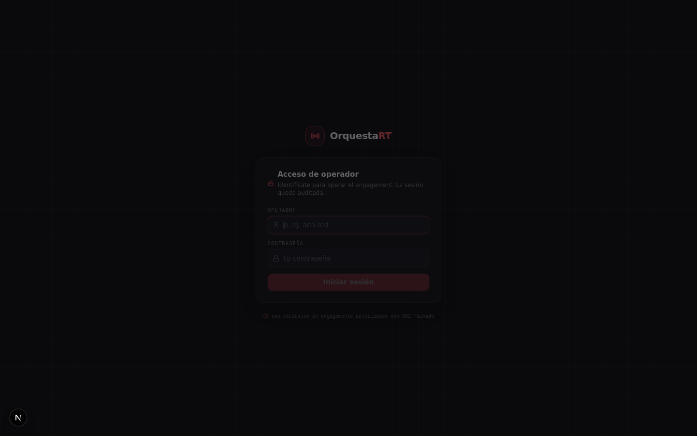
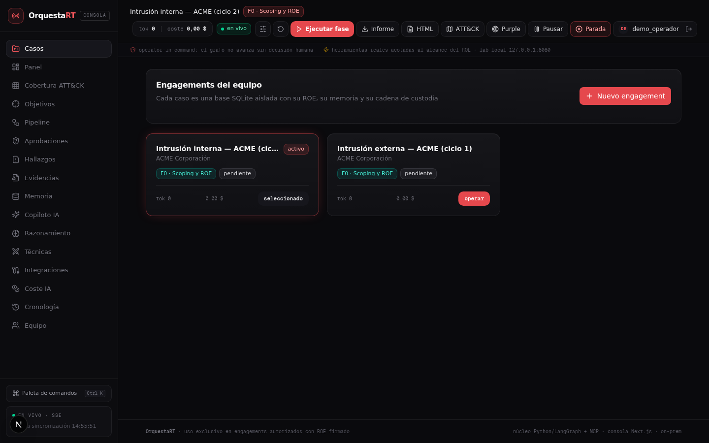
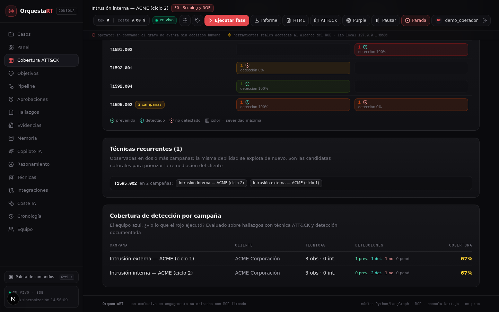
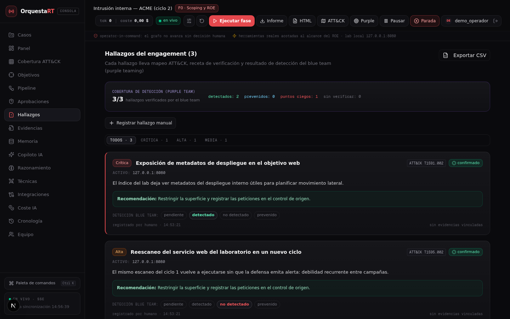
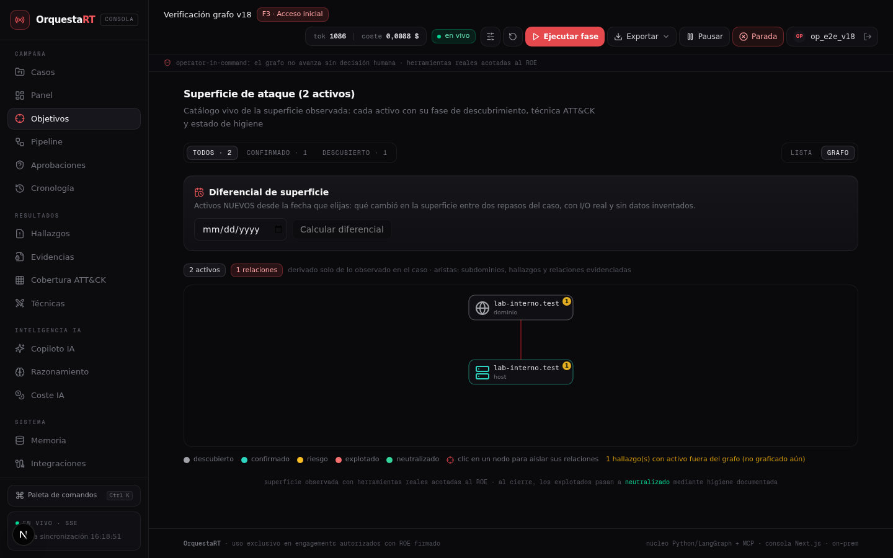
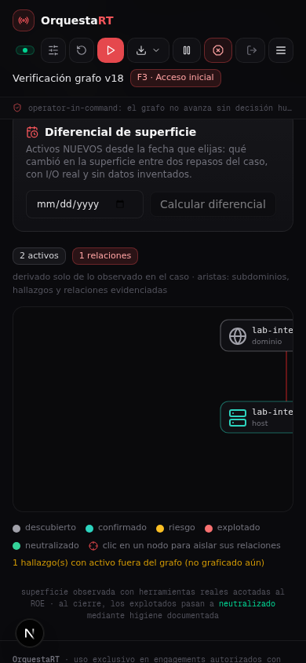
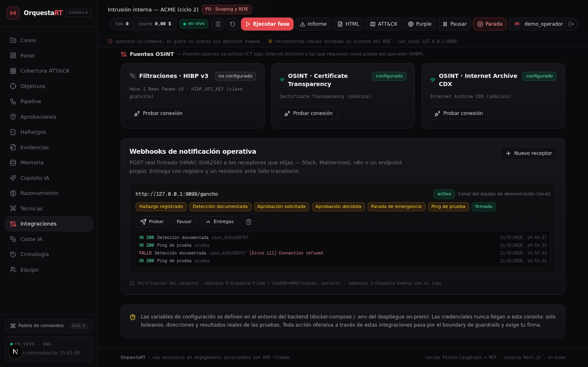
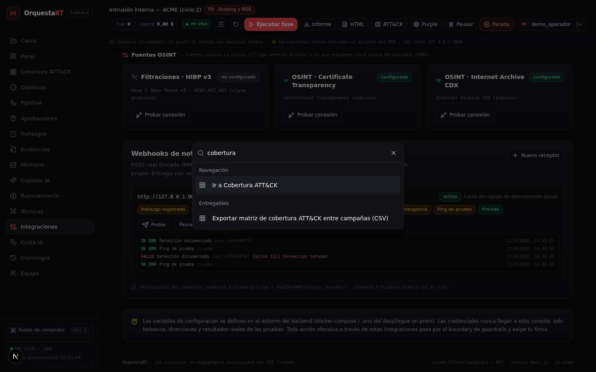
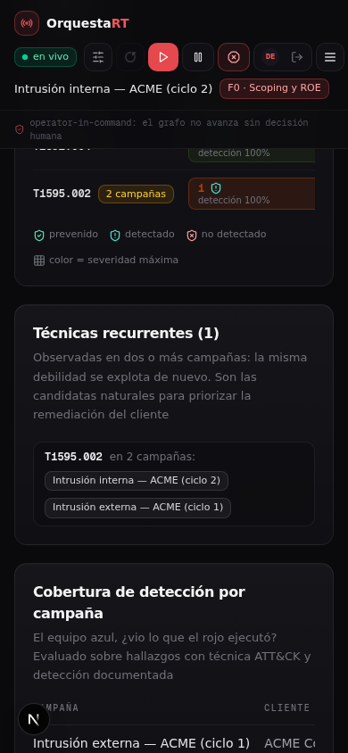

# 🎥 OrquestaRT — Demostración en imágenes

> Todo lo que ves aquí es la consola real operando contra el orquestador real
> (FastAPI + LangGraph) y el laboratorio objetivo (`127.0.0.1:8080`). Sin
> maquetas, sin datos ficticios: cada hallazgo, cada detección y cada entrega
> de webhook de esta demo pasaron por los endpoints y el boundary del
> orquestador, con el ROE del laboratorio local como alcance autorizado.


*Recorrido completo: acceso del operador → campañas → matriz de cobertura
ATT&CK entre campañas → hallazgos con purple teaming → webhooks de
notificación. (Consola 1440px, tema oscuro.)*

---

## 1. Acceso de operador



Identidad real por operador (scrypt + JWT), bloqueo por intentos fallidos y
**alta del primer administrador guiada** en un despliegue nuevo. La sesión
queda auditada; no hay cuentas compartidas ni "usuario admin" por defecto.

## 2. Campañas (engagements)



Cada campaña es un caso aislado: **una base SQLite por engagement**, con su
ROE máquina-legible, su cadena de custodia y su presupuesto de tokens. La
demo muestra dos ciclos reales sobre el mismo cliente de laboratorio.

## 3. Cobertura ATT&CK entre campañas (nueva en v16)


La matriz **técnica × campaña** agrega todos los casos del despliegue con la
misma regla de siempre: solo técnicas realmente **observadas** (hallazgos) o
**intentadas** (solicitudes de aprobación). Nada se rellena.

- El color de cada celda es la **severidad máxima** (misma escala que el
  informe y la capa Navigator); el borde discontinuo marca técnica intentada
  sin hallazgo asociado; los escudos muestran el resultado defensivo
  documentado (prevenido / detectado / no detectado).
- Las **técnicas recurrentes** — la misma debilidad explotada en dos o más
  campañas — salen automáticamente como candidatas a priorizar en la
  remediación.



Y la **cobertura de detección por campaña** (patrón VECTR): qué porcentaje de
lo ejecutado vio el equipo azul. Exportable a CSV con un comando de la paleta.

## 4. Hallazgos y purple teaming



Cada hallazgo lleva mapeo ATT&CK, activo afectado y **selector de detección**
(el operador documenta si el blue team lo detectó, no lo detectó o lo
previno; el registro queda auditado con su identidad). Desde v16 el operador
también puede **registrar hallazgos manuales** con técnica validada en
formato `T####.###` — lo que no cumple formato, no entra.

## 4b. Grafo de relaciones del caso (nuevo en v18)



En **Objetivos → grafo**, la superficie se ve como mapa: dominios arriba,
hosts y servicios debajo, personas/credenciales al final. Las aristas solo
existen si hay relación observada — subdominio registrado, el mismo activo
visto en dos capas, un detalle que menciona a otro objetivo — y los
hallazgos cuelgan como chips numerados de severidad sobre su activo. Clic en
un nodo para aislar sus relaciones.

El aviso ámbar del pie es parte del diseño: si un hallazgo apunta a un activo
que no está graficado, se declara (no se esconde). Nodos sin aristas también
son información: fueron observados, pero aún sin vínculo registrado.



El grafo sigue operativo a 390 px con scroll horizontal propio y el resto de
la página sin overflow.

## 5. Webhooks de notificación operativa (nueva en v16)



Receptores configurables por el admin (Slack, Mattermost, n8n, un endpoint
propio), suscritos por evento — hallazgo registrado, detección documentada,
aprobación solicitada/decidida, parada de emergencia — con **POST firmado
HMAC-SHA256** (`X-Orquesta-Firma`), cabecera de tipo de evento e identificador
de entrega, un reintento ante fallo transitorio y el **registro de entregas**
con el resultado HTTP real de cada intento.

Fíjate en el historial: la entrega `FALLO · Connection refused` es real
también — el receptor de demo estaba caído en ese momento y la plataforma lo
dice, en lugar de fingir un éxito. Cuando el receptor volvió, la misma
detección se entregó `OK 200`.

## 6. Paleta de comandos



Todo el entregable de la plataforma está a un `Ctrl+K`: informe Markdown y
HTML, custodia JSON, respaldo del caso, **capa MITRE ATT&CK Navigator**,
paquete purple team (detección + esqueletos Sigma) y la nueva **matriz de
cobertura entre campañas en CSV**.

## 7. Responsive 390 px



La consola completa — incluida la matriz de cobertura con scroll horizontal —
en un móvil sin overflow: operativo desde el móvil durante un engagement.

---

## Ejecuta tu propia demo

```bash
./install.sh     # crea .venv, instala dependencias y consola
./start.sh       # orquestador :8000 · consola :3000 · lab objetivo :8080
```

Abre `http://localhost:3000`, crea el primer operador y da de alta tu caso
con el alcance del laboratorio (`localhost`, `127.0.0.0/8`). El receptor de
webhook de prueba puede ser un endpoint propio; la firma HMAC se verifica con
el secreto que la consola te muestra **una sola vez** al crearlo.

> ⚠️ **Uso exclusivo en engagements autorizados con ROE firmado.** La
> plataforma bloquea por diseño las técnicas destructivas y exige firma
> humana para toda acción por encima del umbral de riesgo. Véase el
> [README](../README.md) y la [arquitectura](ARQUITECTURA.md).
